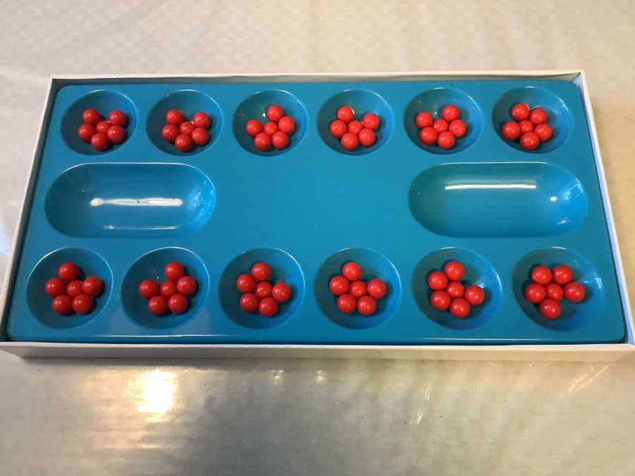

# kalaha
A terminal based implementation in C of the Kalah[a] board game, also known as Mancala.

As there exist lots of variations of the game, this is an implementation of just one of them (see rules below).

## About the game
Kalaha (sometimes known as Kalah or Mancala) is a two player board game. The board has the following setup:

- There are 6 small holes for each player (referred to as just holes). Initially, they are each filled with 6 balls.
- There is one big hole per player on the to the left and above the holes. It is called a player's home.
- Turns are being taken in a clockwise direction

The turn always starts by taking all the balls from any of the holes that belong to the player (but not the home). Then, the balls are being placed one by one out of the hand into each hole clockwise, including the player's own home but excluding the other player's home.
- If the last ball was placed in an empty hole, the turn is over
- If the last ball was placed in a non-empty hole, the player takes all the balls from that hole again and continues this process
- If the last ball was placed in the player's home, they get an extra turn where they can again choose which hole to play.

The game ends whenever either either player has no balls left. The winner is the person who has the greatest sum of the number of balls in their home and the number of balls other player has left in their holes.

## Usage
Build the game by running `make`. Run with `./game.out`.

## TODO:
- Finish this doc
- (in progress) Write documentation for everything lol
- (in progress) Difficulty settings